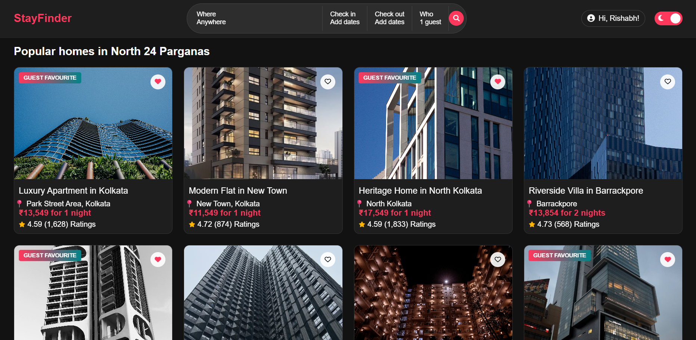
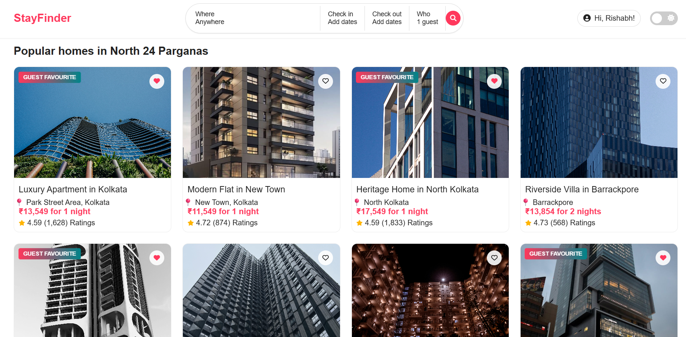

# StayFinder 🏠


**StayFinder** is a modern, stylish Airbnb-inspired vacation rental web app for discovering and booking unique stays in North 24 Parganas and beyond.  
It features a beautiful UI, interactive map, user authentication, favorites, and a seamless booking experience.

---

## ✨ Features

- 🔍 **Smart Search:** Find properties by location, dates, and guests.
- 🏡 **Property Listings:** Browse curated homes with ratings, prices, and guest favorites.
- ❤️ **Wishlist:** Save your favorite stays with a single click.
- 📅 **Animated Date Picker:** Select check-in and check-out dates with a custom, themed calendar.
- 🌐 **Language & Currency Switcher:** Choose your preferred language and currency.
- 🗺️ **Interactive Map:** View property locations on an embedded map.
- 👤 **User Auth:** Register, login, and manage your bookings.
- 🧾 **Booking System:** Book properties and view your reservations.
- 🌙 **Dark Mode:** Toggle between light and dark themes for a comfortable browsing experience.
- 📱 **Responsive Design:** Looks great on desktop and mobile.

---

## 📸 Screenshots

### Home Page


### Property Details & Booking


### Light Mode


---

## 🚀 Live Demo

👉 [View StayFinder on GitHub Pages](https://rishabh028.github.io/StayFinder/index.html)

---

## 🛠️ Tech Stack

- **Frontend:**  
  - HTML5, CSS3 (custom + Animate.css), JavaScript (ES6)
  - [Leaflet.js](https://leafletjs.com/) for interactive maps
  - [Font Awesome](https://fontawesome.com/) for icons

- **Backend:**  
  - Node.js, Express.js, MongoDB (see [`stayfinder-backend`](stayfinder-backend/))

---

## 📂 Project Structure

```
stayfinder/
│
├── index.html
├── styles.css
├── script.js
├── images/
│   ├── logo.png
│   ├── property1.jpg
│   ├── property1-1.jpg
│   ├── ... (other property images)
│
└── stayfinder-backend/
    ├── app.js
    ├── models/
    ├── routes/
    ├── ...
```

---

## ⚡ Getting Started

### 1. **Clone the Repository**

```bash
git clone https://github.com/Rishabh028/StayFinder.git
cd StayFinder
```

### 2. **Frontend (Static)**

Just open `index.html` in your browser, or deploy to GitHub Pages.

### 3. **Backend (Optional, for full-stack features)**

```bash
cd stayfinder-backend
npm install
npm start
```
- Configure your MongoDB URI and JWT secret in `.env`.

---

## 📝 Customization

- **Add Properties:**  
  Edit the `properties` array in [`script.js`](script.js) to add or modify listings.
- **Images:**  
  Place property images in the `images/` folder and reference them in your data.
- **Branding:**  
  Replace `logo.png` and update colors in `styles.css` for your own branding.

---

## 🙌 Credits

- Inspired by [Airbnb](https://airbnb.com)
- [Leaflet.js](https://leafletjs.com/) for maps
- [Font Awesome](https://fontawesome.com/) for icons
- [Animate.css](https://animate.style/) for animations

---

## 📄 License

This project is licensed under the MIT License.

---

## 💡 Author

**Rishabh Rajak**  
[GitHub](https://github.com/Rishabh028) | [LinkedIn](https://www.linkedin.com/in/rishabh-rajak-621318316/)

---

> _StayFinder: Find your perfect stay, anywhere, anytime!_
